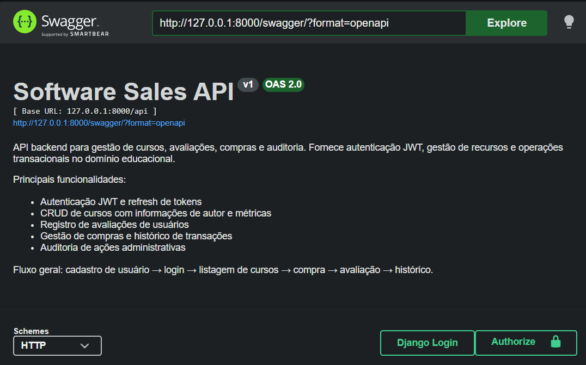
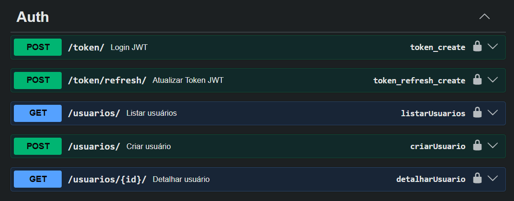
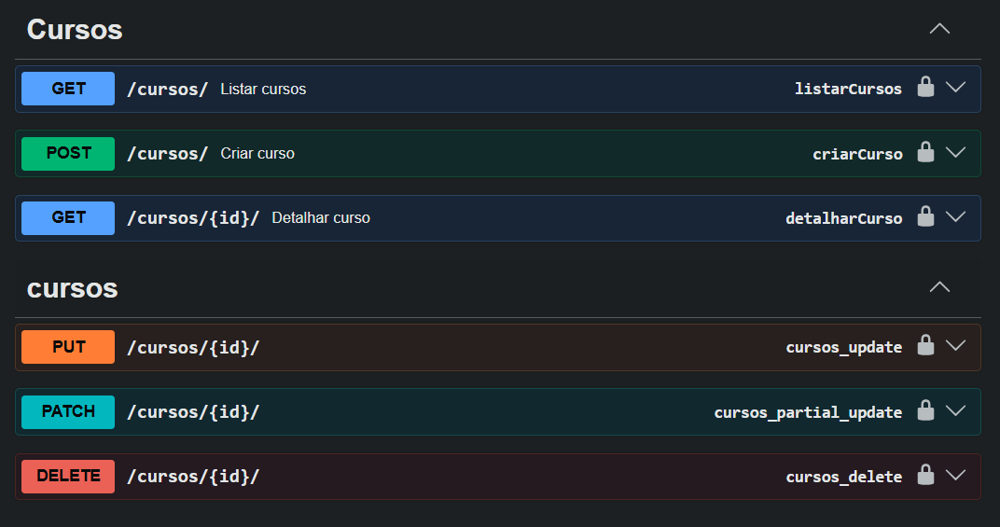
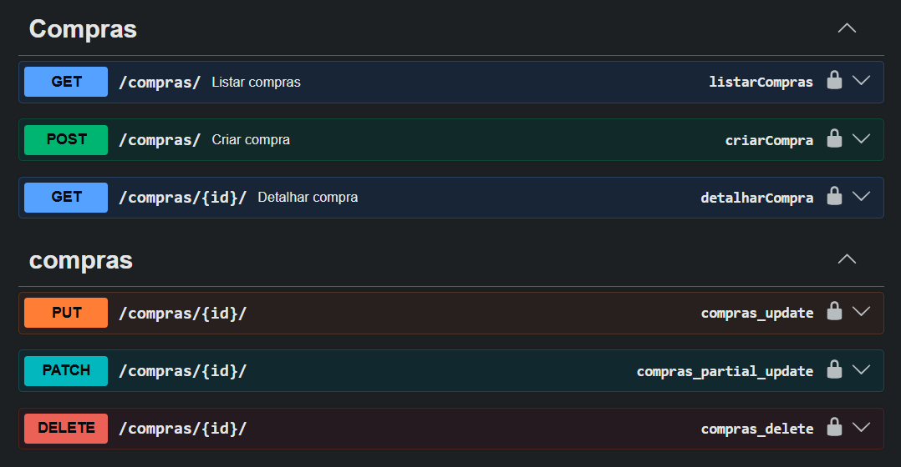
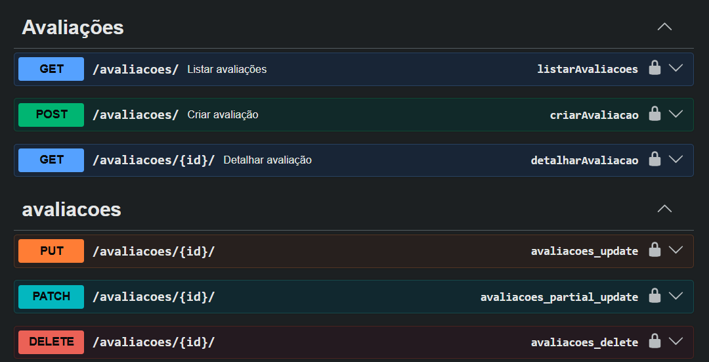
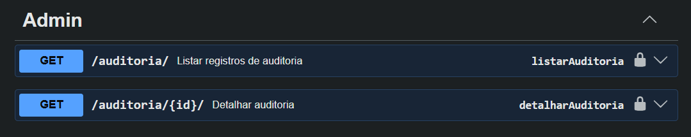

# Software Sales API


---

## Sobre o Projeto

Software Sales API é uma API RESTful profissional para gestão de um marketplace de cursos online. Ela entrega um backend completo para cadastro de usuários, autenticação JWT, gestão de cursos, avaliações, compras e auditoria de ações, com foco em segurança, escalabilidade e documentação API-first.

A API resolve o problema de construir rapidamente um sistema de vendas educativo com recursos essenciais de backend, reduzindo a complexidade de autenticação e operações transacionais. O projeto é ideal para portfólio de desenvolvedores que querem demonstrar domínio de Django, DRF, PostgreSQL e infraestrutura containerizada.

## Tecnologias Utilizadas

### Backend
- Python
- Django
- Django REST Framework
- drf-yasg (Swagger / Redoc)
- Simple JWT

### Banco de Dados
- PostgreSQL
- SQLite (fallback local)

### Infraestrutura
- Docker
- Docker Compose
- Redis
- Celery
- Linux

### Versionamento
- Git
- GitHub

## Arquitetura do Projeto

A estrutura do projeto é organizada em camadas separadas para facilitar manutenção e expansão:

- `software_sales/core/`
  - Configurações do Django, URLs principais, ASGI/WSGI e definições globais.
  - Documentação API via Swagger e Redoc.
- `software_sales/courses/`
  - Modelos de domínio: `Usuario`, `Curso`, `Avaliacao`, `Compra` e `Auditoria`.
  - Serializers para validações e representação de dados.
  - Views com `ModelViewSet` e filtros de busca/paginação.
  - URLs específicas da API.
  - Signals e serviços para atualizar métricas e auditoria.
- `docker/`
  - Scripts de entrada (`entrypoint.sh`, `entrypoint-celery.sh`) e configuração de ambiente.
- Raiz do projeto
  - `Dockerfile`, `docker-compose.yml`, `manage.py`, `requirements.txt`.

## Funcionalidades

- Cadastro de usuários com validação de email e senha.
- Autenticação JWT com geração de access token e refresh token.
- CRUD de cursos com autor associado e cálculo de métricas.
- Avaliação de cursos com nota e comentário.
- Compras de cursos com registro de histórico e status.
- Auditoria de criação, atualização e exclusão de entidades.
- Paginação, filtros por preço, busca por texto e ordenação.
- Documentação interativa via Swagger e Redoc.
- Containerização com Docker e Docker Compose.
- Configuração para Redis e Celery.

## Endpoints

| Método | Endpoint | Descrição |
|---|---|---|
| GET | `/` | Home da API com status, versão e links de documentação |
| GET | `/swagger/` | Interface Swagger da API |
| GET | `/redoc/` | Interface Redoc da API |
| POST | `/api/token/` | Autenticação JWT para gerar access e refresh tokens |
| POST | `/api/token/refresh/` | Renovação de token JWT |
| GET / POST / PUT / PATCH / DELETE | `/api/usuarios/` | Gestão de usuários e cadastro |
| GET / POST / PUT / PATCH / DELETE | `/api/cursos/` | Criação, listagem e manutenção de cursos |
| GET / POST / PUT / PATCH / DELETE | `/api/avaliacoes/` | Gestão de avaliações de cursos |
| GET / POST / PUT / PATCH / DELETE | `/api/compras/` | Registro e consulta de compras |
| GET | `/api/auditoria/` | Visualização do histórico de auditoria |

> Observação: a maioria dos recursos requer autenticação JWT para criação, atualização e exclusão. O cadastro de usuários e o acesso à documentação são públicos.

## Configuração

A aplicação utiliza variáveis de ambiente para separar configurações de ambiente e manter credenciais fora do código.

Principais variáveis:

- `SECRET_KEY` - chave secreta do Django.
- `DEBUG` - habilita modo debug (True/False).
- `DATABASE_URL` - URL de conexão com PostgreSQL ou SQLite.
- `CORS_ALLOWED_ORIGINS` - origens permitidas para CORS.
- `EMAIL_HOST_USER` - usuário SMTP.
- `EMAIL_HOST_PASSWORD` - senha SMTP.
- `DEFAULT_FROM_EMAIL` - email padrão de envio.
- `CSRF_TRUSTED_ORIGINS` - domínios confiáveis para CSRF.

Em ambiente Docker, o projeto já contém `.env.docker` com variáveis de ambiente para os serviços de banco e Redis.

## Instalação

1. Clone este repositório:
   ```bash
   git clone https://github.com/seu-usuario/seu-repositorio.git
   cd api_principal
   ```
2. Crie um ambiente virtual Python:
   ```bash
   python -m venv venv
   source venv/Scripts/activate    # Windows
   source venv/bin/activate       # Linux/macOS
   ```
3. Instale as dependências:
   ```bash
   pip install -r requirements.txt
   ```
4. Copie e edite as variáveis de ambiente:
   ```bash
   copy .env.docker .env          # Windows
   cp .env.docker .env            # Linux/macOS
   ```
5. Ajuste `DATABASE_URL` e `SECRET_KEY` conforme necessário.

## Executando o Projeto

### Com Docker

```bash
docker compose up --build
```

A API estará disponível em `http://localhost:8000`.

### Localmente sem Docker

```bash
python manage.py migrate
python manage.py runserver 0.0.0.0:8000
```

### Com Celery (fila de tarefas)

```bash
docker compose up --build celery
```

## Testes

O projeto possui suporte à suíte de testes com `pytest` e `pytest-django`.

Execute:

```bash
pytest
```

> Observação: atualmente há um esqueleto de testes em `software_sales/courses/tests.py`, então recomendamos adicionar casos de teste conforme o projeto evolui.

## Segurança

- Autenticação JWT para proteção de rotas.
- `rest_framework.permissions.IsAuthenticated` como padrão global.
- CORS configurável via variáveis de ambiente.
- Cookies de sessão e CSRF seguros para produção.
- Controle de taxa por usuário e anônimo via throttling embutido.
- Auditoria de ações de criação, atualização e exclusão.
- Uso de `create_user` para hash seguro de senhas.

## Melhorias Futuras

- Implementar testes automatizados completos.
- Criar endpoints de perfil e permissões avançadas.
- Integrar autenticação social (Google, GitHub, etc.).
- Adicionar documentação de API versionada e changelog.
- Implementar workflows CI/CD com GitHub Actions.
- Incluir relatórios de vendas e métricas analíticas.
- Adicionar cache e otimização de consultas.

## Screenshots

### Visão Geral



Visão geral da documentação Swagger.

---

### Autenticação



Endpoint de autenticação JWT e refresh de tokens.

---

### Cursos



API de cursos com filtros, paginação e operações CRUD.

---

### Compras



Fluxo de compras e histórico transacional.

---

### Avaliações



Cadastro e gerenciamento de avaliações dos usuários.

---

### Administração



Painel administrativo e registros de auditoria.

## 👨‍💻 Autor

**Orlando Conceição**

Front-End & Back-End Developer

📧 orlandoconceicao94@gmail.com